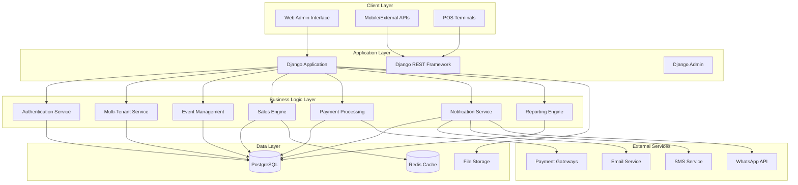
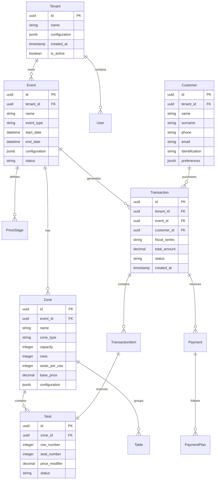
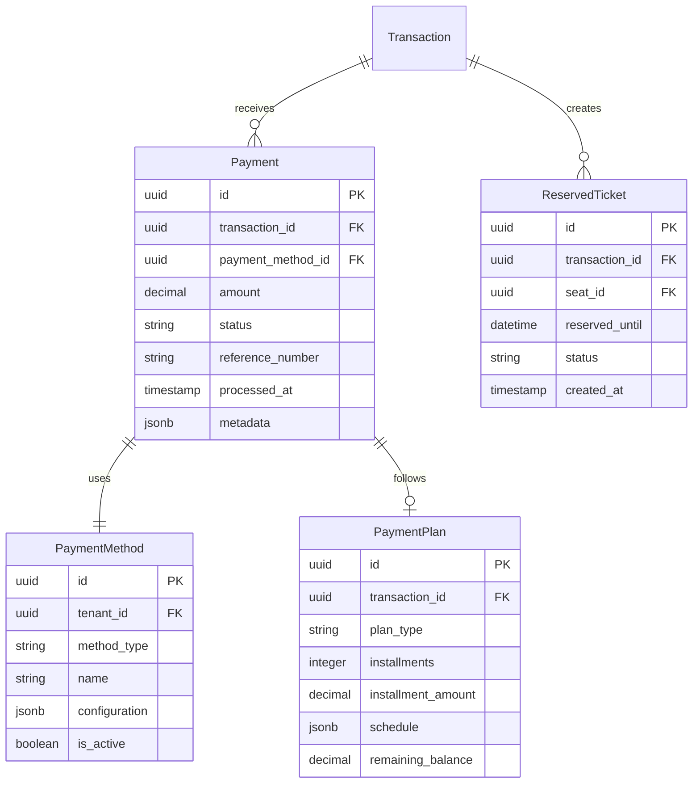

# Design Document

## Overview

The Venezuelan POS System is a comprehensive multi-tenant Django REST API solution designed for complex event ticket sales with Venezuelan fiscal compliance. The system supports both online and offline operations, multiple event types (general admission and numbered seating), flexible pricing strategies, partial payments, and complete customer management with multi-channel notifications.

## Architecture

### High-Level Architecture



### Technology Stack (Production-Ready Libraries)

- **Backend Framework**: Django 5.x with Django REST Framework
- **Database**: PostgreSQL 15+ with django-extensions for optimization
- **Caching**: django-redis with redis-py for high-performance caching
- **Authentication**: djangorestframework-simplejwt (battle-tested JWT)
- **API Documentation**: drf-spectacular (OpenAPI 3.0 auto-generation)
- **Task Queue**: Celery 5.x with Redis broker (proven async processing)
- **Validation**: django-phonenumber-field, django-localflavor (Venezuelan formats)
- **Monitoring**: django-prometheus, structlog, sentry-sdk
- **Performance**: django-debug-toolbar, django-silk (query optimization)
- **Testing**: pytest-django, factory-boy, pytest-cov
- **Deployment**: gunicorn + uvicorn workers for async performance

## Components and Interfaces

### Core Django Apps Structure

```
venezuelan_pos/
├── apps/
│   ├── tenants/           # Multi-tenant management
│   ├── authentication/    # JWT auth and user management
│   ├── events/           # Event and venue management
│   ├── tickets/          # Ticket types and inventory
│   ├── zones/            # Zone and seating management
│   ├── pricing/          # Dynamic pricing engine
│   ├── sales/            # Sales transactions
│   ├── payments/         # Payment processing
│   ├── customers/        # Customer data management
│   ├── notifications/    # Multi-channel messaging
│   ├── reports/          # Analytics and reporting
│   ├── fiscal/           # Venezuelan fiscal compliance
│   └── offline/          # Offline sync management
├── core/                 # Shared utilities and base classes
├── config/              # Django settings and configuration
└── api/                 # API versioning and routing
```

### Key Components

#### 1. Multi-Tenant Service (`apps.tenants`)

**Models:**
- `Tenant`: Organization isolation unit
- `TenantUser`: User-tenant relationships with roles

**Key Features:**
- Complete data isolation using tenant-aware querysets
- Automatic tenant filtering in all database operations
- Role-based access control per tenant

#### 2. Event Management (`apps.events`)

**Models:**
- `Event`: Main event entity with configuration
- `Venue`: Physical or virtual event location
- `EventConfiguration`: Settings for partial payments, notifications

**Key Features:**
- Support for both general admission and numbered seating events
- Mixed event types within single event
- Event status management (draft, active, closed, cancelled)

#### 3. Zone and Seating Management (`apps.zones`)

**Models:**
- `Zone`: Event areas with capacity and pricing rules
- `Seat`: Individual numbered seats (for numbered zones)
- `Table`: Grouped seats for table sales
- `ZoneConfiguration`: Zone-specific settings

**Key Features:**
- Automatic seat generation based on rows and seats per row
- Table grouping with complete/individual sale modes
- Real-time availability checking

#### 4. Dynamic Pricing Engine (`apps.pricing`)

**Models:**
- `PriceStage`: Time-based pricing periods
- `RowPricing`: Row-specific price modifiers
- `ZonePricing`: Base pricing per zone

**Key Features:**
- Sequential price stages with percentage markups
- Row-based pricing with configurable percentages
- Automatic price calculation: Base + Stage + Row

#### 5. Sales Engine (`apps.sales`)

**Models:**
- `Transaction`: Main sales transaction
- `TransactionItem`: Individual tickets within transaction
- `ReservedTicket`: Temporary holds during partial payments
- `OfflineBlock`: Pre-assigned series for offline sales

**Key Features:**
- Idempotent transaction creation using Redis
- Consecutive fiscal series numbering
- Online/offline sales with synchronization
- Partial payment support with reservation system
- **Real-time ticket invalidation using Redis cache**
- **Instant seat availability updates with Redis pub/sub**

#### 6. Payment Processing (`apps.payments`)

**Models:**
- `Payment`: Individual payment records
- `PaymentPlan`: Installment or flexible payment structures
- `PaymentMethod`: Supported payment types configuration

**Key Features:**
- Multiple payment methods (cash, cards, transfers, PagoMovil)
- Installment plans with fixed amounts and dates
- Flexible payments with variable contributions
- Payment reconciliation and audit trails

#### 7. Customer Management (`apps.customers`)

**Models:**
- `Customer`: Customer information registry
- `CustomerPreferences`: Communication preferences

**Key Features:**
- Complete customer data capture (name, surname, phone, email, cédula)
- Privacy compliance with opt-in preferences
- Customer lookup and data updates
- Integration with notification system

#### 8. Notification System (`apps.notifications`)

**Models:**
- `NotificationTemplate`: Message templates
- `NotificationLog`: Delivery tracking
- `NotificationPreference`: Customer communication settings

**Key Features:**
- Multi-channel support (Email, SMS, WhatsApp)
- Template-based messaging with personalization
- Delivery status tracking and retry logic
- Integration with external service providers

#### 9. Reporting Engine (`apps.reports`)

**Models:**
- `SalesReport`: Generated report metadata
- `OccupancyAnalysis`: Zone performance analytics
- `ReportSchedule`: Automated report generation

**Key Features:**
- Sales reports by period, event, zone, operator
- Heat map data for zone popularity analysis
- Export capabilities (JSON, CSV, PDF)
- Real-time analytics and KPI calculation

#### 10. Fiscal Compliance (`apps.fiscal`)

**Models:**
- `FiscalSeries`: Consecutive numbering management
- `FiscalReport`: X and Z report generation
- `AuditLog`: Immutable transaction audit trail

**Key Features:**
- Venezuelan fiscal regulation compliance
- Consecutive series numbering with select_for_update
- X/Z reports with user-specific closures
- America/Caracas timezone enforcement

## Data Models

### Core Entity Relationships



### Payment and Reservation Models



## Error Handling

### Error Response Format

All API endpoints return consistent error responses:

```json
{
    "error": {
        "code": "VALIDATION_ERROR",
        "message": "Invalid input data",
        "details": {
            "field_name": ["Specific error message"]
        },
        "timestamp": "2025-10-25T10:30:00Z",
        "request_id": "uuid-here"
    }
}
```

### Error Categories

1. **Validation Errors** (400): Input data validation failures
2. **Authentication Errors** (401): JWT token issues, expired sessions
3. **Authorization Errors** (403): Insufficient permissions, tenant access
4. **Not Found Errors** (404): Resource not found
5. **Conflict Errors** (409): Business rule violations, seat conflicts
6. **Rate Limit Errors** (429): Too many requests
7. **Server Errors** (500): Internal system errors

### Business Logic Error Handling

- **Seat Double Booking**: Redis-based seat locking + atomic DB transactions
- **Fiscal Series Conflicts**: Database constraints with retry logic
- **Payment Failures**: Rollback with Redis cache cleanup and reservation release
- **Offline Sync Conflicts**: Conflict resolution with audit logging
- **Expired Reservations**: Redis TTL auto-cleanup + scheduled DB cleanup
- **Cache Inconsistency**: Automatic cache invalidation with DB sync verification

## Testing Strategy

### Testing Pyramid

1. **Unit Tests** (70%)
   - Model validation and business logic
   - Service layer functionality
   - Utility functions and calculations
   - Payment processing logic

2. **Integration Tests** (20%)
   - API endpoint testing
   - Database integration
   - External service mocking
   - Multi-tenant data isolation

3. **End-to-End Tests** (10%)
   - Complete user workflows
   - Payment processing flows
   - Notification delivery
   - Offline synchronization

### Test Coverage Requirements

- **Minimum Coverage**: 80% overall
- **Critical Paths**: 95% (payment, fiscal, seat reservation)
- **Business Logic**: 90% (pricing, validation, calculations)
- **API Endpoints**: 85% (all CRUD operations)

### Testing Tools

- **pytest + pytest-django**: Primary testing framework
- **factory_boy**: Test data generation
- **responses**: HTTP request mocking
- **freezegun**: Time-based testing
- **django-test-plus**: Enhanced Django testing utilities

### Performance Testing

- **Load Testing**: Artillery.io or Locust for API endpoints
- **Database Performance**: Query analysis and optimization
- **Caching Effectiveness**: Redis performance monitoring
- **Concurrent User Testing**: Multi-tenant isolation under load

## Security Considerations

### Authentication and Authorization

- **JWT Tokens**: Short-lived access tokens with refresh mechanism
- **Role-Based Access**: Tenant-aware permissions with Django groups
- **Rate Limiting**: Per-user and per-IP request throttling
- **Session Management**: Secure token storage and rotation

### Data Protection

- **Tenant Isolation**: Complete data separation with query-level filtering
- **Customer Data**: GDPR-compliant data handling with opt-in preferences
- **Payment Security**: PCI DSS considerations for payment data
- **Audit Logging**: Immutable logs for all sensitive operations

### API Security

- **Input Validation**: Comprehensive data sanitization
- **SQL Injection Prevention**: ORM usage with parameterized queries
- **CORS Configuration**: Restricted cross-origin access
- **HTTPS Enforcement**: SSL/TLS for all communications

## Performance Optimization

### Database Performance (Production-Ready Approach)

**PostgreSQL Optimization with Proven Tools:**
```python
# django-extensions for query optimization
INSTALLED_APPS += ['django_extensions']

# Database connection pooling with django-db-pool
DATABASES = {
    'default': {
        'ENGINE': 'django_db_pool.backends.postgresql',
        'OPTIONS': {
            'MAX_CONNS': 20,
            'MIN_CONNS': 5,
        }
    }
}
```

**Performance Libraries:**
- **django-silk**: Query profiling and N+1 detection
- **django-debug-toolbar**: SQL query analysis in development
- **django-extensions**: shell_plus, graph_models, and optimization tools
- **psycopg2-binary**: High-performance PostgreSQL adapter

**Optimized Query Patterns:**
- **select_related()**: Built-in Django foreign key optimization
- **prefetch_related()**: Efficient many-to-many and reverse FK loading
- **django.db.models.Q**: Complex query optimization
- **django.db.transaction.atomic()**: Transaction management
- **Model.objects.bulk_create()**: Batch inserts for performance

### High-Performance Caching Strategy (Production Libraries)

**django-redis Configuration:**
```python
# settings.py - Optimized Redis setup
CACHES = {
    'default': {
        'BACKEND': 'django_redis.cache.RedisCache',
        'LOCATION': 'redis://redis:6379/1',
        'OPTIONS': {
            'CLIENT_CLASS': 'django_redis.client.DefaultClient',
            'CONNECTION_POOL_KWARGS': {
                'max_connections': 100,
                'retry_on_timeout': True,
            },
            'SERIALIZER': 'django_redis.serializers.json.JSONSerializer',
            'COMPRESSOR': 'django_redis.compressors.zlib.ZlibCompressor',
        }
    }
}

# Use django-redis for sessions (faster than DB)
SESSION_ENGINE = 'django.contrib.sessions.backends.cache'
SESSION_CACHE_ALIAS = 'default'
```

**Performance-Optimized Operations:**
- **django.core.cache.cache**: Built-in caching decorators and utilities
- **django-redis pipeline**: Batch Redis operations for efficiency
- **Atomic transactions**: django.db.transaction.atomic for consistency
- **Select_for_update**: Built-in Django ORM locking mechanism
- **Prefetch_related**: Optimized query loading for related objects

**Proven Libraries for Speed:**
- **redis-py**: Official Redis client with connection pooling
- **django-extensions**: Database query optimization tools
- **django-silk**: Real-time query profiling and optimization
- **django-debug-toolbar**: Development performance monitoring

### Caching Strategy

- **Redis Caching**: Session storage and frequently accessed data
- **Query Caching**: Database query result caching
- **API Response Caching**: Cacheable endpoint responses
- **Static File Caching**: CDN integration for static assets

### Production Performance Stack

**Proven Async Processing:**
- **Celery 5.x**: Battle-tested task queue with Redis broker
- **celery-beat**: Scheduled tasks for cleanup and reports
- **flower**: Real-time Celery monitoring dashboard
- **django-celery-results**: Task result backend integration

**Monitoring and Observability:**
- **sentry-sdk**: Error tracking and performance monitoring
- **django-prometheus**: Metrics export for Prometheus
- **structlog**: Structured logging with JSON output
- **django-health-check**: Automated health endpoints

**High-Performance Deployment:**
- **gunicorn**: WSGI server with multiple worker processes
- **uvicorn workers**: ASGI workers for async performance
- **nginx**: Reverse proxy with static file serving
- **redis-sentinel**: Redis high availability and failover

## Deployment Architecture

### Container Strategy

```dockerfile
# Multi-stage Docker build
FROM python:3.11-slim as base
# Application dependencies and code
FROM base as production
# Production optimizations and security
```

### Infrastructure Components

- **Application Servers**: Multiple Django instances behind load balancer
- **Database**: PostgreSQL with read replicas and automated backups
- **Cache Layer**: Redis cluster for high availability
- **Message Queue**: Redis for Celery task processing
- **File Storage**: Configurable backend (local, S3, etc.)
- **Monitoring**: Prometheus + Grafana for metrics and alerting

### Environment Configuration

- **Development**: Single container with SQLite for rapid development
- **Staging**: Production-like environment for testing
- **Production**: Multi-container deployment with high availability
- **CI/CD**: GitHub Actions for automated testing and deployment

## Performance Targets and Optimizations

### Target Performance Metrics

- **API Response Time**: p95 < 150ms, p99 < 300ms
- **Ticket Validation**: < 10ms (Redis cache hit)
- **Concurrent Users**: 1000+ simultaneous users
- **Throughput**: 200+ transactions per second
- **Database Queries**: < 5 queries per API call (optimized with select_related)
- **Cache Hit Rate**: > 90% for frequently accessed data

### Production-Ready Performance Libraries

**Essential Performance Stack:**
```python
# requirements.txt - Performance-focused dependencies
django==5.0.*
djangorestframework==3.14.*
django-redis==5.4.*
redis==5.0.*
psycopg2-binary==2.9.*
celery==5.3.*
gunicorn==21.*
uvicorn[standard]==0.24.*
django-silk==5.0.*
django-extensions==3.2.*
sentry-sdk==1.38.*
```

**Key Optimizations:**
- **Connection Pooling**: pgbouncer + django-db-pool for database efficiency
- **Query Optimization**: django-silk for N+1 detection and resolution
- **Caching Layers**: django-redis with compression and serialization
- **Async Processing**: Celery for non-blocking operations
- **Static Files**: WhiteNoise for efficient static file serving
- **Monitoring**: Sentry for real-time performance tracking

### Proven Architecture Patterns

- **Repository Pattern**: Using Django's built-in ORM optimizations
- **Service Layer**: Business logic separation with django-extensions
- **Cache-Aside Pattern**: django-redis with automatic invalidation
- **Circuit Breaker**: django-health-check for service monitoring
- **Database Migrations**: Django's built-in migration system
- **API Versioning**: DRF's built-in versioning support

This design leverages battle-tested Django ecosystem libraries to provide maximum performance and reliability for the Venezuelan POS system.