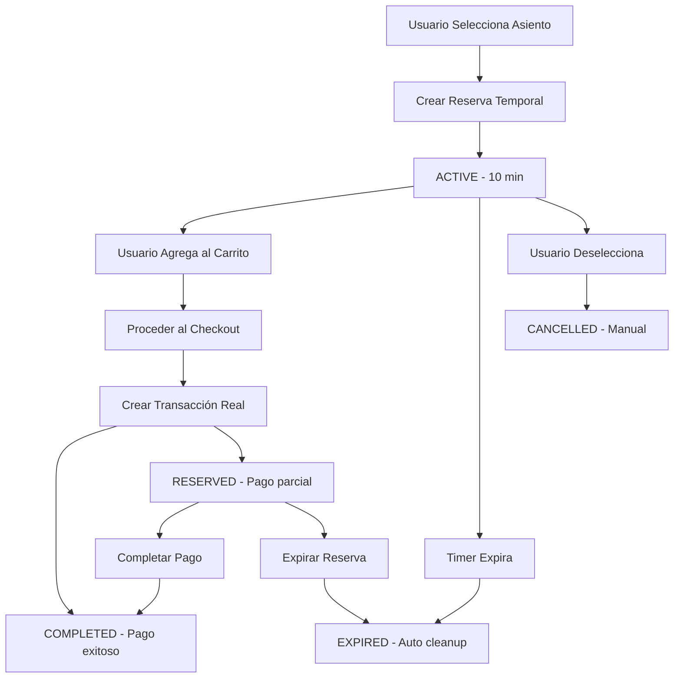

# 🎫 Sistema de Reservas - Venezuelan POS

## 📋 Tipos de Reservas

### 1. **Reservas Temporales** (Selección de Asientos)
- **Duración**: 10 minutos
- **Propósito**: Prevenir conflictos durante la selección
- **Alcance**: Por sesión de usuario

### 2. **Reservas de Pago Parcial** (Transacciones)
- **Duración**: Configurable (ej: 24-72 horas)
- **Propósito**: Mantener asientos mientras se completa el pago
- **Alcance**: Por transacción específica

## 🔄 Flujo de Reservas Temporales

### Paso 1: Usuario Selecciona Asiento
```javascript
// Frontend - seat_selection.html
function toggleSeat(seatElement) {
    const seatId = seatElement.dataset.seatId;
    
    if (selectedSeats.has(seatId)) {
        // Deseleccionar - liberar reserva
        selectedSeats.delete(seatId);
        releaseSeatReservation(seatId);
    } else {
        // Seleccionar - crear reserva temporal
        reserveSeat(seatId, seatElement);
    }
}
```

### Paso 2: Crear Reserva Temporal
```javascript
function reserveSeat(seatId, seatElement) {
    fetch('/sales/seats/reserve/', {
        method: 'POST',
        headers: {
            'Content-Type': 'application/json',
            'X-CSRFToken': getCookie('csrftoken')
        },
        body: JSON.stringify({
            seat_ids: [seatId]
        })
    })
    .then(response => response.json())
    .then(data => {
        if (data.success) {
            selectedSeats.add(seatId);
            seatElement.classList.add('selected', 'reserved-by-me');
            showReservationTimer(seatId, data.expires_at);
        }
    });
}
```

### Paso 3: Backend Crea Reserva
```python
# Backend - web_views.py
@require_POST
@login_required
def reserve_seats(request):
    # Crear transacción temporal para la sesión
    temp_transaction, created = Transaction.objects.get_or_create(
        tenant=request.user.tenant,
        fiscal_series=f"TEMP_{session_key}",
        defaults={
            'status': Transaction.Status.PENDING,
            'total_price': Decimal('0.00'),
        }
    )
    
    # Reservar por 10 minutos
    reservation_time = timezone.now() + timedelta(minutes=10)
    
    reservation = ReservedTicket.objects.create(
        transaction=temp_transaction,
        seat=seat,
        zone=seat.zone,
        reserved_until=reservation_time,
        status=ReservedTicket.Status.ACTIVE,
        quantity=1
    )
```

## 🏗️ Estructura de Datos

### Modelo ReservedTicket
```python
class ReservedTicket(TenantAwareModel):
    class Status(models.TextChoices):
        ACTIVE = 'active', 'Active'
        EXPIRED = 'expired', 'Expired'
        COMPLETED = 'completed', 'Completed'
        CANCELLED = 'cancelled', 'Cancelled'
    
    # Relaciones
    transaction = models.ForeignKey(Transaction, ...)
    seat = models.ForeignKey(Seat, null=True, ...)  # Para asientos numerados
    zone = models.ForeignKey(Zone, ...)
    
    # Detalles
    quantity = models.PositiveIntegerField(default=1)  # Para admisión general
    reserved_until = models.DateTimeField()
    status = models.CharField(max_length=10, choices=Status.choices)
```

### Transacción Temporal
```python
# Identificador único por sesión
fiscal_series = f"TEMP_{session_key}"

# Estados posibles
Transaction.Status.PENDING  # Reserva temporal
Transaction.Status.RESERVED # Pago parcial
Transaction.Status.COMPLETED # Pago completo
```

## ⏰ Gestión de Tiempo

### 1. **Timer en Frontend**
```javascript
function showReservationTimer(seatId, expiresAt) {
    const expirationTime = new Date(expiresAt);
    const timeLeft = expirationTime - new Date();
    
    reservationTimers[seatId] = setTimeout(() => {
        // Reserva expirada
        const seatElement = document.querySelector(`[data-seat-id="${seatId}"]`);
        seatElement.classList.remove('selected', 'reserved-by-me');
        selectedSeats.delete(seatId);
        
        showMessage('Seat reservation expired', 'warning');
    }, timeLeft);
}
```

### 2. **Limpieza Automática en Backend**
```python
# Tarea Celery - tasks.py
@shared_task
def cleanup_expired_reservations():
    expired_count = ReservedTicket.objects.filter(
        status=ReservedTicket.Status.ACTIVE,
        reserved_until__lt=timezone.now()
    ).update(status=ReservedTicket.Status.EXPIRED)
```

## 🔄 Estados de Reserva

### Ciclo de Vida Completo



## 🛡️ Prevención de Conflictos

### 1. **Validación de Disponibilidad**
```python
# Antes de crear reserva
existing_reservation = ReservedTicket.objects.filter(
    seat=seat,
    status=ReservedTicket.Status.ACTIVE,
    reserved_until__gt=timezone.now()
).exclude(transaction=temp_transaction).first()

if existing_reservation:
    return JsonResponse({
        'success': False, 
        'error': f'Seat {seat.seat_label} is already reserved'
    })
```

### 2. **Actualización de Cache**
```python
# Invalidar cache después de reservar
sales_cache.invalidate_seat_availability(seat_id)
```

### 3. **Polling de Disponibilidad**
```javascript
// Verificar disponibilidad cada 5 segundos
setInterval(() => {
    fetch('/sales/ajax/seat-availability/')
        .then(response => response.json())
        .then(data => {
            // Actualizar estado visual de asientos
            updateSeatAvailability(data.availability);
        });
}, 5000);
```

## 📊 Monitoreo y Métricas

### 1. **Dashboard de Reservas**
- Reservas activas por evento
- Reservas próximas a expirar
- Tasa de conversión (reserva → venta)

### 2. **Alertas Automáticas**
- Reservas que expiran en < 1 hora
- Asientos con múltiples intentos de reserva
- Patrones de abandono de carrito

### 3. **Comandos de Gestión**
```bash
# Limpiar reservas expiradas
python manage.py cleanup_expired_reservations

# Estadísticas de reservas
python manage.py reservation_stats

# Extender reservas masivamente
python manage.py extend_reservations --hours 24
```

## 🔧 Configuración

### Variables de Entorno
```python
# settings.py
RESERVATION_SETTINGS = {
    'TEMPORARY_HOLD_MINUTES': 10,
    'PARTIAL_PAYMENT_HOURS': 72,
    'CLEANUP_INTERVAL_MINUTES': 5,
    'MAX_RESERVATIONS_PER_USER': 10,
}
```

### Personalización por Tenant
```python
# Cada tenant puede tener configuraciones diferentes
class TenantSettings(models.Model):
    reservation_hold_minutes = models.IntegerField(default=10)
    partial_payment_hours = models.IntegerField(default=72)
    max_reservations_per_session = models.IntegerField(default=10)
```

## 🚀 Optimizaciones

### 1. **Cache de Disponibilidad**
- Redis para estado de asientos en tiempo real
- Invalidación selectiva por zona/asiento
- TTL automático para datos temporales

### 2. **Batch Operations**
- Reservar múltiples asientos en una transacción
- Liberación masiva al cerrar sesión
- Cleanup por lotes para mejor rendimiento

### 3. **WebSocket (Futuro)**
- Notificaciones en tiempo real de cambios
- Sincronización instantánea entre usuarios
- Reducir polling de disponibilidad